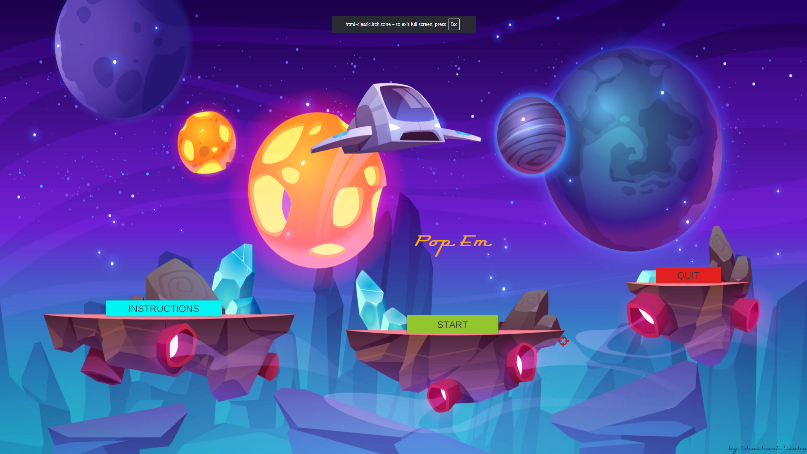
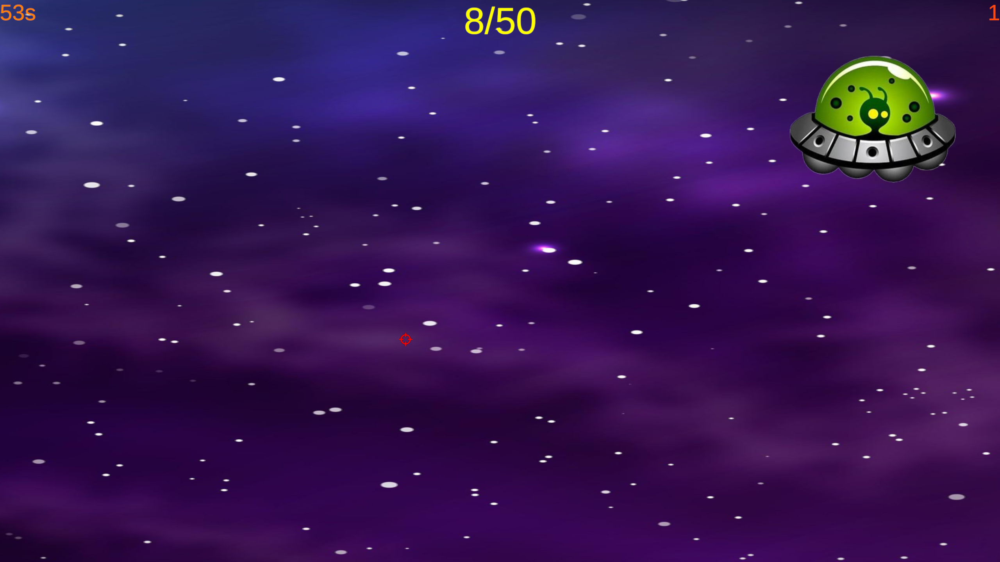
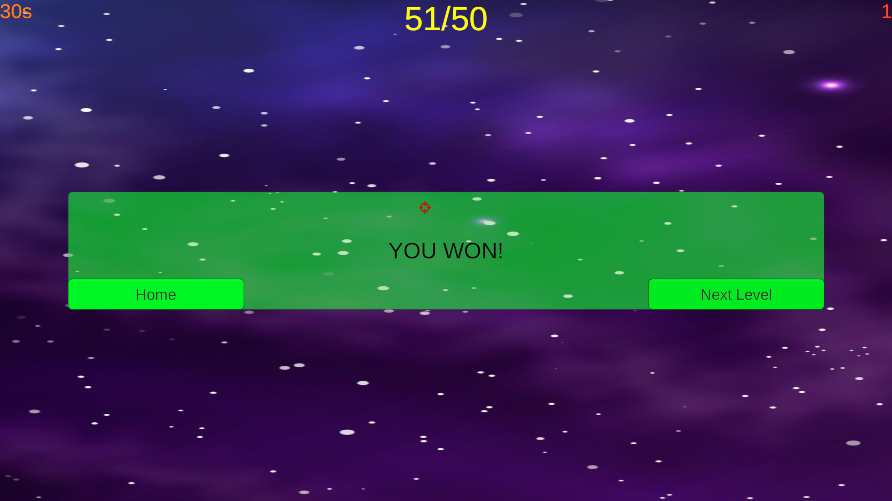
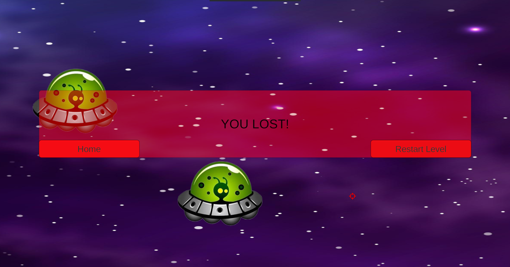

# 🚀 Pop Em – Alien Shooter (Unity 2D Game)

A reaction-based 2D shooter built in Unity demonstrating event-driven gameplay logic, dynamic difficulty scaling, and cross-platform deployment.

---

**Pop Em – Alien Shooter** is a fast-paced 2D space shooter developed using **Unity and C#**, where players eliminate incoming alien targets within a limited time.
The game focuses on reaction speed, accuracy, and progressively increasing difficulty through level-based gameplay.

Available for **web play and Windows download**.

---

## 🎮 Gameplay Overview

Players control a **crosshair cursor** using mouse movement (or touch input on supported devices) and eliminate alien targets by clicking or tapping on them.
The objective is to achieve the required score within the time limit to progress through increasingly challenging levels.

---

## 🕹 Core Mechanics

### 🎯 Player Controls

* Mouse-controlled crosshair for aiming
* Click/tap to eliminate alien targets
* Supports mouse and touch-based input
* No keyboard controls required

### 👾 Enemy System

* Randomized enemy spawning across screen
* Dynamic spawn positioning based on game window
* Increasing spawn rate with level progression
* Despawn timing decreases with difficulty scaling
* Balanced difficulty progression across levels

### 📈 Level & Score System

* +5 points per alien eliminated
* −1 point per missed alien
* Each level has a target score requirement
* Player advances after reaching required score
* Target score increases progressively per level
* Session-based progression system

### ⏱ Difficulty Scaling

* Countdown timer-based gameplay
* Available time decreases per level
* Higher levels demand faster reaction time
* Game ends when timer expires

---

## 🔊 Audio & UI

### Audio

* Menu and gameplay audio
* Alien hit sound effects
* Win and lose feedback sounds

### UI Screens

* Main menu (Start / Instructions / Quit)
* Instruction screen
* Gameplay screen
* Win screen
* Lose screen

---

## 🧠 Technical Highlights

* Developed using **Unity Engine** and **C#**
* Event-driven input handling for mouse/touch interaction
* Dynamic enemy spawning and lifecycle management
* Score tracking and level progression system
* Difficulty scaling using timer and spawn adjustments
* Scene and UI state management
* Cross-platform build support (Web and Windows)

---

## 🌐 Play & Download

**Play Online:**
https://cbsinha.itch.io/pop-em-alien-shooter

**Windows Build:**
Available for download on the itch.io page.

---

## 📸 Screenshots

---

## ⚙ Tech Stack

* Unity (2D)
* C#
* Unity UI System
* WebGL & Windows build support

---

## 👨‍💻 Made by

**Shashank Sinha**
